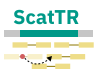

<p align="center">
  
</p>

---

[](https://crates.io/crates/scattr)
[](https://github.com/rashidalabri/scattr/actions)

ScatTR is a method for estimating the copy number of large tandem repeats (TRs) from paired-end short-read whole-genome sequencing (WGS) data. 

## Installation

### Pre-built binaries

Binaries for the latest version of ScatTR can be found in the [releases](https://github.com/rashidalabri/scattr/releases) page.

### Build from source

* Install the rust toolchain in order to have `cargo` installed by following
  [this](https://www.rust-lang.org/tools/install) guide.
* Run `cargo install scattr`

## Usage

Below are instructions on how to use the tool, along with descriptions of the available commands, arguments, and options.

### Multi-step workflow

Refer to the [example directory](https://github.com/rashidalabri/scattr/tree/main/example) for a comprehnsive overview of the workflow, explanations and formats of the input files. In general, to run the complete ScatTR workflow:

1. **Extract depth and insert distributions:**

```
scattr output/sample stats input/sample.bam
```

2. **Extract the bag of reads:**

```
scattr output/sample extract input/sample.bam input/catalog.tsv
```

3. **Define optimization problems:**

```
scattr output/sample define input/catalog.tsv input/reference.fa
```

4. **Estimate TR copy numbers:**

```
scattr output/sample genotype
```

Each command will produce output files with the given prefix. The commands must be run in the given order since each step will expect the outputs of the previous steps (with the same output prefix).


### Basic Usage

ScatTR is run with the following basic command structure:

```
scattr <OUTPUT_PREFIX> [COMMAND] [OPTIONS] <INPUTS>
```

- `<OUTPUT_PREFIX>`: Prefix for output files, including the directory where outputs will be saved.
- `[COMMAND]`: Specifies the step of the workflow to perform (e.g., `stats`, `extract`, `define`, `genotype`).
- `[OPTIONS]`: Optional parameters that modify the behavior of each command.

### Available commands (steps)

#### 1. `stats`

This command extracts the read depth and insert size distribution from an alignment file.

**Usage:**

```
scattr <OUTPUT_PREFIX> stats [OPTIONS] 
```

- `<ALIGNMENT>`: Path to the alignment file (BAM or CRAM).
- `-n, --num-regions <NUM_REGIONS>`: Number of regions to sample (default: 100).
- `-l, --region-length <REGION_LENGTH>`: Length of each sampled region (default: 100000).
- `-@ <THREADS>`: Number of HTSlib threads to use for reading the alignment file.
- Other options include `--min-depth-mapq`, `--min-insert-mapq`, `--dc`, `--ds`, etc., to customize depth and insert size filtering. Use `--help` option to view details.

#### 2. `extract`

This command extracts the bag of reads, which are read-pairs that are likely to originate from the TR loci specified in the catalog.

**Usage:**

```
scattr <OUTPUT_PREFIX> extract [OPTIONS]  
```

- `<ALIGNMENT>`: Path to the alignment file (SAM, BAM or CRAM).
- `<CATALOG>`: Path to the tandem repeat catalog file (TSV format).
- `-@ <THREADS>`: Number of HTSlib threads to use for reading the alignment file.
- Other options include `-e`, `--mapq-f`, `--mapq-i`, etc., to customize read extraction behavior. Use `--help` option to view details.

#### 3. `define`

This command generates definitions of the optimization problems needed to estimate the copy number of TR loci in the catalog. It requires the output of the `extract` command.

**Usage:**

```
scattr <OUTPUT_PREFIX> define [OPTIONS] <CATALOG> <REFERENCE>
```

- `<CATALOG>`: Path to the TR catalog file (TSV format).
- `<REFERENCE>`: Path to the reference genome (FASTA format). A index file `.fa.fai` must also exist.
- Options include `--bag`, `-n`, etc., to customize the problem definition process and input file paths.  Use `--help` option to view details.

#### 4. `genotype`

This command estimates the copy number for each TR locus. It required the output of the `stats` and `define` commands.

**Usage:**

```
scattr <OUTPUT_PREFIX> genotype [OPTIONS]
```

- Use the `--hom` option to specify that TR copy number optimization process should assume that the TRs are homozygous. Otherwise, the assumption is that the TRs are heteroyzygous (with normal allele being the same as the reference)
- Use the `-n, --n-bootstraps` option to specify the number of bootstraps for estimating genotype confidence intervals (default: 10).
- Other options include `--stats`, `--defs`, etc., to customize TR copy number estimation parameters and input file paths.

### General Options

- `-t, --threads <THREADS>`: Number of ScatTR threads to use. Only useful for `define` and `genotype` commands to process loci in parallel.

## License

Licensed under either of

 * Apache License, Version 2.0
   ([LICENSE-APACHE](LICENSE-APACHE) or http://www.apache.org/licenses/LICENSE-2.0)
 * MIT license
   ([LICENSE-MIT](LICENSE-MIT) or http://opensource.org/licenses/MIT)

at your option.

## Contribution

Unless you explicitly state otherwise, any contribution intentionally submitted
for inclusion in the work by you, as defined in the Apache-2.0 license, shall be
dual licensed as above, without any additional terms or conditions.

See [CONTRIBUTING.md](CONTRIBUTING.md).
